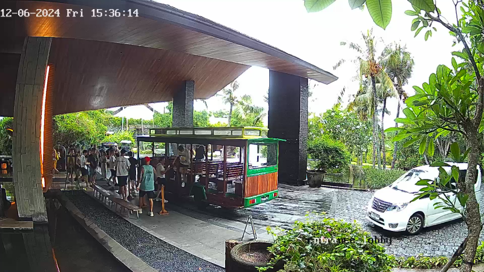
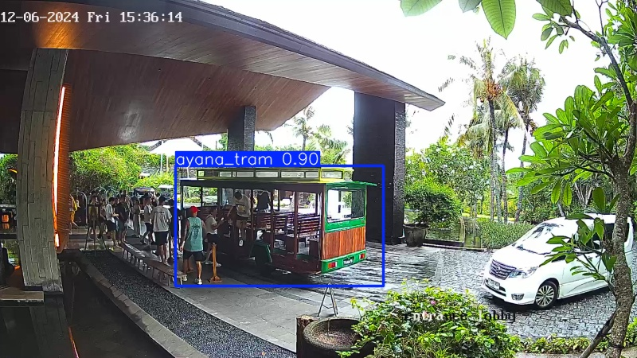

# Build custom YOLO11 model for AYANA's Tram Detection

This guide explains the complete process of building a custom YOLO11 model for detecting AYANA's trams, from data collection to implementation.

## Table of Contents
1. [Data Collection](#1-data-collection)
2. [Data Labeling](#2-data-labeling)
3. [Dataset Organization](#3-dataset-organization)
4. [Training Preparation](#4-training-preparation)
5. [Training The Custom Model](#5-training-the-custom-model)
6. [Implementation](#6-implementation)


## 1. Data Collection

### Requirements
- Collect at least 50-100 screenshots of the AYANA's Tram
- Include various angles and lighting conditions
- Include different backgrounds
- Capture both close-up and distant views

In the first phase, we use 80 screenshots (64 train, 16 validation).Collected screenshots are stored in:
```
ayana-tram-detection/
├── build_custom_model/
│   ├── data/
│   │   ├── images/
│           └── train/
```

## 2. Data Labeling

### Install LabelImg
```
pip install labelimg
```

### Labeling Process
1. Launch LabelImg:
```
labelimg
```

2. Configure LabelImg:
- Open Dir → `ayana-tram-detection/build_custom_model/data/images/train`
- File → Change Save Dir → `ayana-tram-detection/build_custom_model/data/labels/train`
- View → Auto Save Mode
- View → YOLO format

3. Labeling Steps:
- Press 'W' to start drawing box
- Draw box around the tram
- Type class name: "ayana_tram" (please be consistent with the naming)
- Press 'D' to move to next image or Press 'A' to move to previous image 

### Labeling Guidelines
- Include the entire tram in the box
- Be consistent with labeling across all images
- Label even partially visible trams
- Ensure boxes are as tight as possible

## 3. Dataset Organization

### Split Dataset & Create data.yaml
Use the command below:
```bash
python split_dataset_create_yaml.py
```

### Directory Structure After Run The Command
```
data/
├── images/
│   ├── train/
│   │   └── (your images)
│   └── val/
│       └── (validation images)
├── labels/
│   ├── train/
│   │   └── (your labels)
│   └── val/
│       └── (validation labels)
└── data.yaml
```

## 4. Training Preparation
Make sure the packages below are installed.

### Install Dependencies
```bash
pip install ultralytics opencv-python pytz pyyaml scikit-learn
```

### Double-Check data.yaml
Use the command below:
```bash
python check_yaml.py
```

## 5. Training The Custom Model
We use Jupyter Notebook (`train.ipynb`) to train the custom model.
```python
# Train model with default settings
model, results = train_custom_model(
    model_size='n',    # Start with nano model for quick training
    epochs=100,        # Number of epochs
    imgsz=640,         # Image size
    batch_size=16      # Batch size (adjust based on your GPU memory)
)
```

### Training Parameters
- `model_size`: Model size (n=nano, s=small, m=medium, l=large, x=extra large)
- `epochs`: Number of training iterations
- `imgsz`: Input image size
- `batch_size`: Number of images processed at once

## Estimated Train Process Time using Apple MacBook M3
- CPU: Several hours to days (depending on dataset size and model size)
- GPU: 2-8 hours (depending on GPU capability)
- n (nano) = 45mins~
- x (nano) = 8hours~

### Best Model
The best model from the training result will be located in:
```
runs/train/{YYYYMMDD_HHMMSS}/weights/best.pt
```

## 6. Implementation

### Detect AYANA's Tram
```bash
python detect_using_custom_model.py
```
Input the required parameters:
```
Please input the model name or YYYYMMDD_HHMMSS: 20241207_082659
Please input the image path: /Users/fchrulk/AHM/Production/ayana-tram-detection-cctv/production/rimba_tram_stop_captured_frames/20241206/frame_20241206_153649.png
Please input the confidence threshold (0.25 ~ 1.0): .5
```
#### Example Input


#### Example Output


## Best Practices
1. **Data Collection**
   - Collect diverse images
   - Include different lighting conditions
   - Include different angles
   - Include different backgrounds

2. **Labeling**
   - Be consistent with bounding boxes
   - Label all instances in each image
   - Ensure tight bounding boxes

3. **Training**
   - Start with smaller model for testing
   - Use GPU if available
   - Monitor training metrics
   - Use early stopping

4. **Implementation**
   - Adjust confidence threshold based on needs
   - Test with various conditions
   - Monitor performance

## Troubleshooting
1. **Common Issues**
   - Path errors in data.yaml
   - Incorrect label format
   - Memory issues during training
   - CUDA/GPU issues

2. **Solutions**
   - Verify file paths
   - Check label format
   - Reduce batch size
   - Use CPU if GPU unavailable

## Additional Resources
- [YOLO11 Documentation](https://docs.ultralytics.com/)
- [LabelImg Documentation](https://github.com/heartexlabs/labelImg)